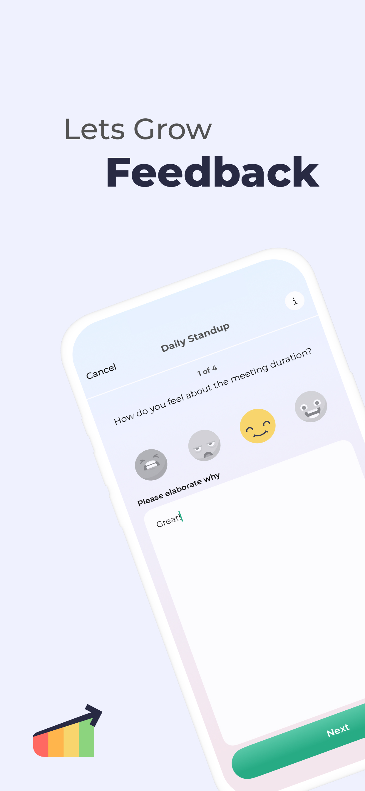
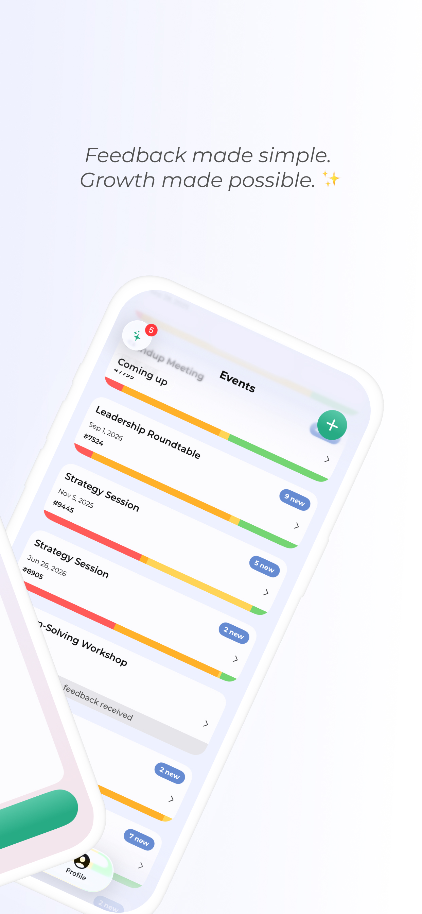
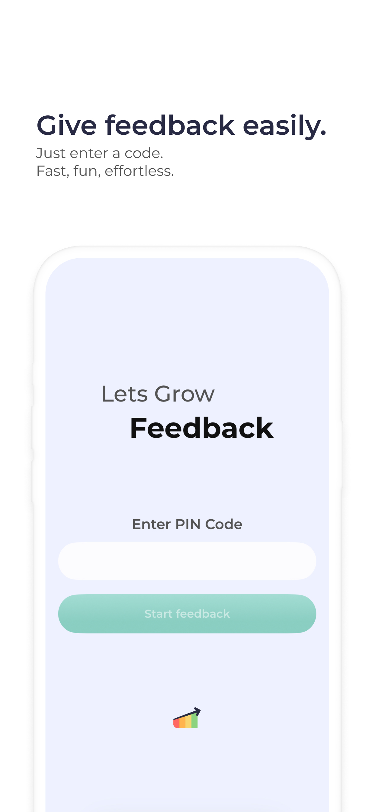
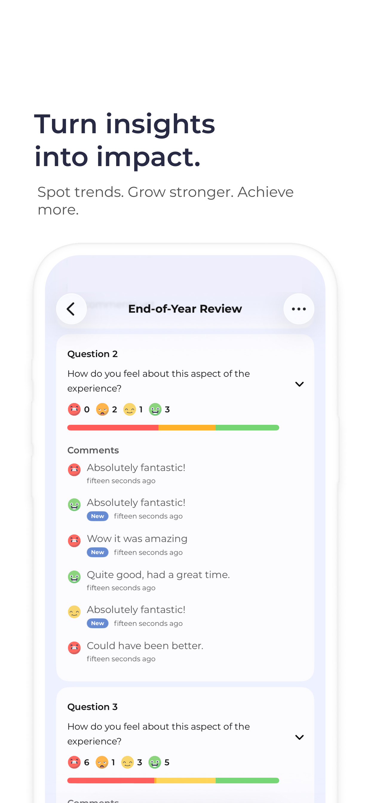
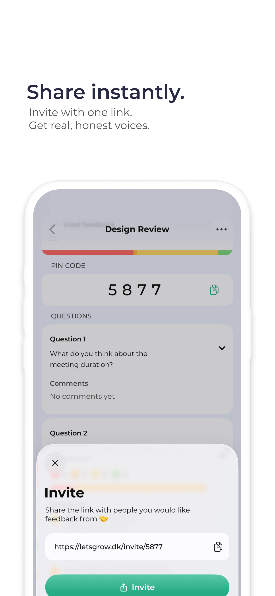
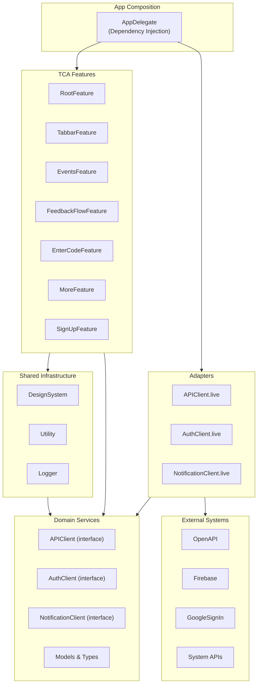

# Lets Grow: Feedback iOS App


This repository contains the source code for the **Lets Grow: Feedback** iOS app, available on the [App Store](https://apps.apple.com/us/app/lets-grow-feedback/id6742420307).  
The app is 100% SwiftUI, [The Composable Architecture (TCA)](https://github.com/pointfreeco/swift-composable-architecture) and leverages iOS 26’s **Liquid Glass** effects.

<p float="left">
  
  
  
  
  
</p>


---

## 🔧 Requirements
- Swift 6.2  
- Xcode 26  
- iOS 26  
- SwiftLint (`brew install swiftlint`)


## 🗂 Project structure

```
Xcode_project/
  App/                         # App entry, AppDelegate, Composition Root
  Modules/
    Sources/
      RootFeature/             # App root reducer & navigation
      EnterCodeFeature/        # Join flow
      FeedbackFlowFeature/     # Feedback screens and flow
      EventsFeature/           # Event list/detail/create
      MoreFeature/             # Settings/account
      SignUpFeature/           # Sign up
      TabbarFeature/           # Tab coordination
      Domain/                  # Models, errors, service interfaces 
      Adapters/                # Live implementations (API, Firebase, etc.)
      OpenAPI/                 # Spec + generated client (plugin)
      DesignSystem/            # Theme, styles, reusable views
      Logger/, Utility/, InfoPlist/  # Cross‑cutting utilities
    Tests/                     # Reducer & snapshot tests
  Resources/                   # Assets, launch screen, localization
  Docs/                        # Documentation, screenshots, push samples
```

See also: `Xcode_project/Modules/Package.swift` for module targets and dependencies.


---

## 🔌 API Layer

The API layer is fully generated from the committed monorepo OpenAPI contract.  
This ensures the client stays in sync with the backend contract.

- Canonical spec lives at `../contracts/openapi/feedback-api.yaml`.
- `Modules/Sources/OpenAPI/openapi.yaml` is a symlink to that contract so the Swift OpenAPI plugin can consume it.
- Generation is handled by the Swift OpenAPI Generator plugin during builds; no manual step needed.
- The live `APIClient` is injected via TCA dependencies.

---

## 🧪 Testing

- Unit and reducer tests: `Xcode_project/Modules/Tests/`
- Snapshot tests via `swift-snapshot-testing`
- Run from Xcode or use the `xcodebuild test` command above.


---

## ⚙️ Configuration

Runtime configuration is provided via `Info.plist` keys and read by a small wrapper in `InfoPlist`.

Required keys:

| Key | Example | Purpose |
| --- | --- | --- |
| `API_BASE_URL` | `api.myhost.com` | Backend host |
| `API_SCHEME` | `https` | Backend scheme |
| `WEB_BASE_URL` | `app.myhost.com` | Web deep link host |
| `WEB_SCHEME` | `https` | Web scheme |
| `SUPPORT_EMAIL` | `support@myhost.com` | Support link |
| `APPSTORE_ID` | `1234567890` | App Store links |

Schemes select different environments (Prod/Debug/Localhost/Mock) using `.xcconfig` under `Xcode_project/App/Config/`.

---

## 🐞 Debugging & Preview

- In `DEBUG` builds a debug overlay (`DebugMenuView`) is available.
- Dedicated preview apps exist under `Xcode_project/PreviewApps/` for focused UI flows.


---

## 🔔 Notifications

- Push is enabled via `Xcode_project/App/Entitlements.entitlements`.
- Sample payloads are in `Docs/push_notifications/`.
- Local testing on a booted simulator or device:

```bash
xcrun simctl push booted <your.bundle.id> Docs/push_notifications/new_feedback_received.apns
```

Details: [Docs/NOTIFICATIONS.md](Docs/NOTIFICATIONS.md)


---

## 🧰 CI

- `Xcode_project/CI_scripts/ci_post_clone.sh` relaxes SwiftPM plugin fingerprint checks (needed for the OpenAPI generator) in CI environments.


## 🏗️ Architecture

The app uses a **TCA-based modular architecture** built with Swift Package Manager.  
Features are self-contained modules that compose together to create the full app experience.

### How It Works

**TCA Features** (`RootFeature`, `EnterCodeFeature`, `FeedbackFlowFeature`, etc.) are the main building blocks:
- Each feature manages its own state, business logic, and UI using TCA patterns
- Features can embed child features and share state via `@Shared`
- All user interactions and system events flow through TCA actions

**Domain Services** provide clean interfaces for external interactions:
- `APIClient`, `AuthClient`, `NotificationClient` defined as protocols
- Features call these services via TCA's dependency injection (`@Dependency`)
- Never directly depend on external SDKs or frameworks

**Adapters** implement the domain services using real integrations:
- Live implementations use Firebase, OpenAPI-generated clients, system APIs
- Easy to swap for mocks during testing
- All external complexity is contained here

**Shared Infrastructure** supports all features:
- `DesignSystem`: UI components, theme colors, typography
- `Utility`: Extensions and cross-cutting helpers  
- `Logger`: Structured logging with multiple outputs  



